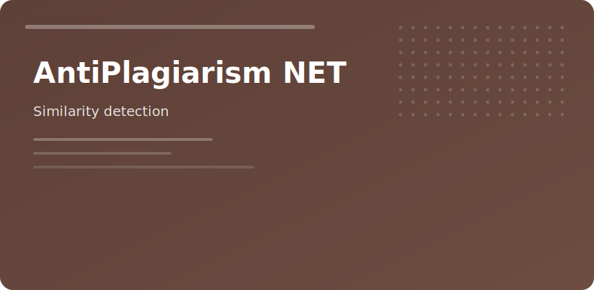

  

  

# AntiPlagiarism NET

Compare manuscripts against web indexes and local corpora for **overlap percentage** and **matched sources**.

## Report sections

1. Overall uniqueness score
2. Highlighted matched fragments
3. Source URLs or local files
4. Side-by-side diff panes

## Settings

| Parameter | Guidance |
|-----------|----------|
| Sensitivity | Higher for short abstracts |
| Language | Set per document |
| Exclusions | Bibliography, quotes |

Suitable for theses, journal submissions, and editorial QA—not a substitute for citation discipline.

antiplagiarism net similarity detection academic writing research
